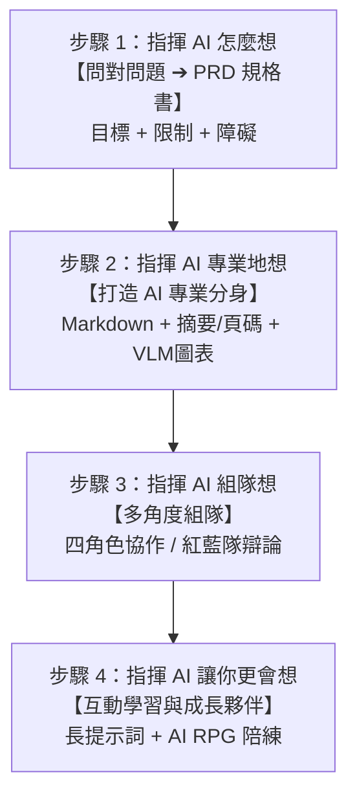

# 指揮 AI 四步驟技能 (Directing AI Methodology)

本技能基於「AI 超級大腦體驗課」的指揮 AI 方法論，將使用者從「問了 AI 但得到廢話」轉變為「精準指揮 AI 解決真實問題」，並透過結構化提示、知識庫建構、組隊思考與 RPG 陪練，讓 AI 成為強大的專業分身與思考成長夥伴。

---

## 🧭 指揮 AI 四步驟核心工作流



---

## 1️⃣ 步驟 1：指揮 AI 怎麼想 — 問對問題與 PRD 規格書

### 核心原則
* **不直接給模糊抱怨**，將問題拆解為「問對問題三要素」：
  1. **目標**：具體、可量化、有期限（我到底想達成什麼？怎樣算成功？）。
  2. **限制**：無法改變的邊界條件（什麼是我不能動的？必須接受的現實？）。
  3. **障礙**：真正需要解決的核心難題（阻擋我達成目標的「那件事」是什麼？）。
* **教 AI 像教助理**：以「我要幹嘛 / 該給你什麼」開頭，讓 AI 主動反問需求，一題一題釐清。

### 📋 PRD 問題規格書模板
```markdown
# 問題規格書 (PRD)

1. 核心問題：[描述真正的核心痛點，非表象抱怨]
2. 目標用戶：[誰會使用/誰是利害關係人]
3. 核心功能/交付物：[AI 需要產出的具體項目]
4. 邊界限制：[時間、預算、格式、隱私、無法變更的環境]
5. 成功標準：[明確、可驗證的指標，如：每週處理時間 < 10分鐘、零額外花費]
```

---

## 2️⃣ 步驟 2：指揮 AI 專業地想 — 打造 AI 專業分身

### 三種 AI 的層次
1. **一般通用 AI**（基礎模型）＝ 什麼都略懂的實習生。
2. **AI 超級大腦**（基礎模型 ＋ 思考習慣）＝ 會用框架思考的顧問。
3. **AI 專業分身**（基礎模型 ＋ 思考習慣 ＋ 專業知識庫）＝ 公司裡最資深的前輩。

### 🛠️ 知識庫前置處理三技巧
1. **PDF / EPUB 轉 Markdown**：
   * PDF 充滿排版噪音與浮水印；先轉成 Markdown（推薦 MinerU 或 EPUB 轉檔），讓 AI 讀取乾淨文字。
2. **AI 製作摘要與關鍵字**：
   * 每章產出「100 字內摘要」＋「5-10 個核心關鍵字」＋「標註頁碼起點終點」，建立知識庫的目錄與索引。
3. **VLM（視覺語言模型）處理圖表**：
   * 將流程圖、架構圖、數據趨勢圖截圖丟給 VLM，產出結構化文字描述，存入 Markdown 對應章節。
4. **培訓素材用「過程」**：
   * 訓練 AI 改稿或決策時，給予「初稿 ＋ 修改過程 ＋ 最終版」，保留原始脈絡。

---

## 3️⃣ 步驟 3：指揮 AI 組隊想 — 多角度組隊思考

### 🎭 模式一：四角色協作模式
適用場景：計劃或決策需要全面審查時。

```markdown
我需要你同時扮演四個思考角色，從不同角度分析我的問題：

【批判思考者】：找出邏輯漏洞、未驗證假設、潛在偏誤。
【創意思考者】：提出替代方案、跨領域借鏡、把限制轉化為機會。
【溝通思考者】：評估受眾反應、核心論點清晰度、表達與媒介弱點。
【互動思考者】：分析利害關係人反應、連鎖效應、潛在倫理問題。

請依序讓四個角色各自發表 200-300 字分析，最後產出一份「綜合建議」。

我的問題/計劃是：[填入內容]
```

### ⚔️ 模式二：紅藍隊辯論模式
適用場景：爭議性決策進行壓力測試（如：投資、轉職、推新產品）。

```markdown
我需要你模擬一場「紅隊 vs 藍隊」的辯論，對我的決策進行壓力測試：

【紅隊（挑戰方）】：批判思考者 + 互動思考者。
任務：全力找出風險、漏洞與連鎖反應。扮演魔鬼代言人，不留情面。

【藍隊（辯護方）】：創意思考者 + 溝通思考者。
任務：針對紅隊質疑，提出回應、跨界類比與風控解方，強化可行性。

【裁判（整合者）】：
聽完辯論後裁定：哪些質疑是致命的必須修正？哪些是過度擔心的？給出最終執行/修改/放棄建議。

辯論流程：1. 紅隊先攻 ➔ 2. 藍隊回應 ➔ 3. 紅隊追問 ➔ 4. 裁判裁定。

我的決策是：[填入內容]
```

---

## 4️⃣ 步驟 4：指揮 AI 讓你更會想 — 互動學習與成長夥伴

### 📝 長提示詞練習模板
```markdown
<background>
這個問題的來龍去脈是什麼？我為什麼會遇到這個問題？
</background>

<goal>
我想達成什麼？（具體、可量化）
</goal>

<constraints>
什麼是不能改變的？有什麼限制條件？
</constraints>

<attempts>
我已經試過什麼方法？為什麼沒有用？
</attempts>

<expected_format>
我希望你用什麼形式回答？（條列式、表格、分析報告...）
</expected_format>
```

### 🎮 AI RPG 角色扮演學習法
將 AI 當作陪練對象（如：難纏客戶、巴菲特投資審查、挑剔主管、高管教練）：

```markdown
你現在要扮演以下角色，跟我進行一場互動對話：

【角色設定】
角色名稱：[例如：Coach Lin / 資深創投合夥人]
角色背景：[例如：20年高管教練經驗 / 15年矽谷創投]
角色性格：[例如：溫暖但犀利，在說「我不知道」時追問到底]

【互動規則】
1. 完全進入角色，用角色的口吻與思維回應，不要跳出角色給「AI 的建議」。
2. 每次回應控制在 200 字以內，保持對話節奏。
3. 如果我說了不合理的事，用角色的方式挑戰我。

【結束條件】
當我說「結束」或對話達 15 輪時，跳出角色給我回饋（做得好的 2-3 點、需改進的 2-3 點、真實情境可能結果）。

請開始，先向我打招呼並問我第一個問題。
```

---

## ⚠️ 關鍵操作鐵律
1. **新對話鐵律**：每個獨立任務開新對話，避免舊上下文污染造成幻覺。
2. **主動互動原則**：拒絕單向「提問 ➔ 複製答案」，必須主動追問、質疑、辯論，大腦才會同步升級。
